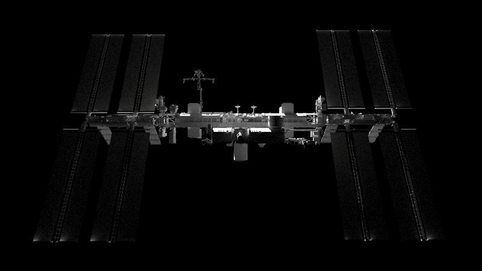

# Deep Space Ray Tracer

<div align="center">
  
</div>

## 🧠 Overview

**Deep Space Ray Tracer** is a GPU based renderer built from the foundations of [Peter Shirley’s **Ray Tracing in One Weekend**, **Ray Tracing: The Next Week**, and **Ray Tracing: The Rest of Your Life**](https://raytracing.github.io/). After completing all three books in CPU form, the renderer was extended and ported to CUDA with support for **triangle meshes**, **BVH acceleration**, **double-precision deep-space coordinates**, and **directional solar lighting**.

The system renders spacecraft in **real orbital-mechanics-driven scenarios**. Camera and model poses are generated using a Kepler + SPICE pipeline, exported to a `.txt` file, and consumed by the GPU renderer frame-by-frame.

NASA’s official **[ISS 3D model](https://science.nasa.gov/resource/international-space-station-3d-model/)** serves as the primary rendering asset.

---

## ⚙️ Core Functionality

| Component | Description |
|----------|-------------|
| **CPU Orbital Simulator** | Solves Kepler’s problem for a 2-body lunar polar orbit. Uses JPL SPICE to compute the Moon’s absolute position relative to the Sun. Outputs pose `.txt` files. |
| **Pose File Parser** | Reads per-frame camera and ISS positions + yaw/pitch/roll from a `.txt` file. |
| **Double-Precision World Frame** | Handles large-scale distances (10⁶–10⁹ m) without floating-point drift. |
| **Model-Frame Transform System** | Converts world-frame coordinates to ISS model frame using double-precision rotations. |
| **Directional Sun Lighting** | Sun direction is computed from SPICE ephemerides and treated as an infinite directional emitter. |
| **Triangle Mesh Rendering** | Loads and renders NASA's ISS OBJ file with proper materials and scaling. |
| **BVH Acceleration Structure** | Efficient GPU triangle traversal for large meshes. |
| **CUDA Path Tracer** | Full GPU-based renderer adapted from the book series with triangle support. |
| **Image Exporter** | Saves PPM → PNG and optionally upscales outputs using a Python upsampler. |

---

## 🧩 Rendering Pipeline Summary

1. **Orbital Simulation**
   - A simple 2-body Kepler solver generates a lunar **polar orbit**.
   - Moon’s state is retrieved using **NASA JPL SPICE** relative to the Sun.
   - Camera and ISS positions are computed in the Sun-centered inertial frame.

2. **Pose File Generation**
   - For each frame, the simulator outputs the positions of the target and chaser vehicles in units of **meters**.

3. **Transformation into Model Frame**
   - The ray tracer reads the poses, then:
     - Computes camera → ISS relative vectors
     - Applies the frame rotation
     - Converts double → float only after constructing the local frame
     - Computes normalized Sun direction

4. **Scene Assembly**
   - ISS mesh placed at the origin  
   - Camera pointed at the ISS  
   - Directional light stored as a normalized vector  
   - GPUScene built with triangles, BVH nodes, and camera parameters

5. **CUDA Rendering**
   - Path tracing is performed entirely on the GPU:
     - Shadow rays
     - Bounce recursion
     - Material shading
     - Triangle intersection via BVH

6. **Export & Upscaling**
   - Saves PPM → PNG  
   - Optional AI upscaling via the `--upscale` flag

---

## 🛰️ Running the Lunar Orbit Simulation

The lunar orbit simulation generates the camera/ISS trajectory and exports the pose `.txt` file used by the GPU renderer.

### Create the Conda Environment for the Luanr Orbit Simulation

> The environment requirements for the orbital sim are located in:  
> `orbit_sim/environment.yml`

Create the environment:

```bash
conda env create -f orbit_sim/environment.yml
conda activate orbit_sim
```
### Run the Lunar Polar Orbit Simulation
This produces chaser and target vehicle states in meters and writes the pose file used by the ray tracer.
```bash
python .\lunar_polar_orbit_sim.py --time 1 --dt 0.01
```
The script will output rendezvous_1s_dt0_01s.txt where --time → total simulation duration in seconds & --dt → timestep resolution (smaller = more frames)

## 📊 Deep Space Ray Tracer Build & Example Usage

### Configure and Build (from top of repo)
***NOTE***
- This was compiled on a windows machine running on an RTX 2070. Will 100% not run out the box for a linux based system. 

```bash
# From the top of the repository:
mkdir build
cd build

# Configure
cmake ..

# Build (Release configuration)
cmake --build . --config Release
```
---
### Run the Ray Tracer (no upscaling)
```bash
.\Release\ray_tracer.exe ^
  --input_txt ..\orbit_sim\rendezvous_1s_dt0_01s.txt ^
  --output_dir os_1s_dt0_01s
```
### Run the Ray Tracer (with upscaling)
***NOTE***
- To use --upscale, you must:
- Build the Conda environment using the .yml file in scripts/
- Ensure the upsample command in main.cpp is updated to point to your Conda Python path and correct upsample.py location.
```bash
.\Release\ray_tracer.exe ^
  --input_txt ..\orbit_sim\rendezvous_1s_dt0_01s.txt ^
  --output_dir os_1s_dt0_01s
```

## 🎥 Ray Tracer Results (Sampled vs. Upsampled)

To demonstrate the practical visual difference between **raw GPU path-traced output** and **AI-upsampled output**, a set of example renderings has been included as a downloadable archive. These results were generated using:

- **Orbital Simulation:** 1 second of lunar polar orbit  
- **Timestep (dt):** 0.01 seconds  
- **Renderer:** Deep Space Ray Tracer (CUDA)  
- **Samples Per Pixel (spp):** *Raw GPU Video - 1000 spp and Upsampled Video 250 spp*  

You can download the `.zip` file containing both sets of results here:

👉 **[Download Sampled & Upsampled Results (Google Drive)](YOUR_GOOGLE_DRIVE_LINK_HERE)**

## 📈 A Note on Upsampling

Deep Space Ray Tracer includes an optional **post-processing upsampler** designed to increase rendering throughput for scenarios where higher frame rates or faster iteration cycles are required. By lowering the number of samples per pixel (spp), the GPU can produce frames much more quickly, while an external **super-resolution model** reconstructs fine detail and improves visual quality.

This workflow mirrors modern real-time graphics pipelines and provides several advantages:

- **Higher frame rates**  
  Reducing spp dramatically decreases the cost of each render pass, enabling smoother and faster updates.

- **Improved responsiveness**  
  Particularly useful for interactive visualization, rapid spacecraft maneuver prototyping, or iterative scene development.

- **Flexible quality–performance tradeoff**  
  Enables developers to choose between physically accurate offline rendering or accelerated rendering enhanced by AI-based super-resolution.

While the included upsampling implementation works well for many cases, it is **not exhaustive nor perfect**.  
Exploring alternative models—such as ESRGAN variants, Real-ESRGAN, latent diffusion super-resolution, or more recent transformer-based upscalers—may yield better sharpness, temporal consistency, or artifact suppression depending on the use case.

The upsampling step is activated with the `--upscale` flag and uses the Python environment defined in the `/scripts` directory. Although optional, it offers a powerful mechanism for accelerating rendering pipelines while preserving the clarity needed for visualization, analysis, or dataset generation.

## 🚀 A Note for Developers Extending *Ray Tracing in One Weekend* to the GPU

This project may be especially useful for developers who are interested in taking the original **Ray Tracing in One Weekend** codebase and extending it into a **full GPU-accelerated renderer**. During development, it became clear that nearly all publicly available GPU ports of Peter Shirley’s work focus exclusively on the **[first book](https://developer.nvidia.com/blog/accelerated-ray-tracing-cuda/)** of the series. I was unable to find a complete GPU implementation that also covers **Ray Tracing: The Next Week** and **Ray Tracing: The Rest of Your Life**—including triangle meshes, BVHs, and full path tracing.

This repository addresses that gap by providing:

- A **complete CUDA-based GPU path tracer**, not just the sphere-based CPU starter.
- **Triangle mesh support** capable of loading arbitrary `.obj` and `.mtl` files.
- A **GPU-ready BVH acceleration structure** adapted from the book series.
- A modernized C++17 structure that remains faithful to the original educational design.
- A clean separation between **CPU scene construction** and **GPU scene execution**, making it easier to study, modify, or extend.

The codebase is intentionally modular, allowing developers to:

- **Strip out the custom orbital mechanics logic** and use the renderer as a standalone GPU ray tracer.
- **Remove the deep-space double-precision transforms** if only local scenes are needed.
- **Replace or augment the mesh loader** to support more advanced materials, textures, or large-scale scenes.
- **Use the triangle/BVH system independently**, even without the GPU path tracer, as a high-performance geometry backbone.

Whether you're building a renderer for research, learning GPU programming, or extending the *Ray Tracing in a Weekend* series into a full production-style pipeline, this project provides a flexible starting point that goes beyond the common sphere-only GPU ports found online.

## ⚠️ Weaknesses & Future Work

As with any early-stage GPU renderer, there are several limitations and areas for future improvement:

- **Single-Mesh Limitation**  
  The current system supports only one triangle mesh at a time, with all world-to-model coordinate transforms centered on that object. This creates issues in multi-vehicle scenes—for example, if a chaser spacecraft moves between the Sun and the target, its shadow will **not** be cast onto the target, since secondary occluding geometry is not yet handled.

- **Sun Brightness Model Is Approximate**  
  Sun radiance is currently hand-tuned (“off vibes”). A more accurate model should incorporate **physical solar irradiance**, falloff over AU-scale distances, and possibly spectral energy considerations. A future version should compute sunlight intensity based on distance-from-Sun equations rather than a fixed constant.

- **Limited GPU Parallel Optimization**  
  While the core rendering loop is parallelized using CUDA, the project is not written by a parallel programming expert. There are likely many opportunities for performance improvements—including memory coalescing, warp divergence reduction, caching strategies, and more efficient BVH traversal techniques.

- **Simplified Coordinate Transforms**  
  The world → model transforms were designed quickly to support deep-space rendering and may not fully capture all edge cases. A more formal and general transformation pipeline should be added, particularly for scenes with multiple moving bodies.

- **Lack of Planetary Occlusion & Secondary Lighting**  
  The renderer currently assumes the Sun has an unobstructed line of sight to the spacecraft. If the **Earth or Moon** blocks sunlight, or if reflected light from these bodies should be visible, the renderer does not handle this. Proper planetary occlusion and secondary illumination are important steps for realism.

- **Significant Room for Overall Improvement**  
  As with any custom GPU ray tracer, there are almost certainly additional weaknesses not yet identified—especially in parallel efficiency, memory layout, and sampling strategies. There is substantial future work available for anyone interested in extending or optimizing the system.
